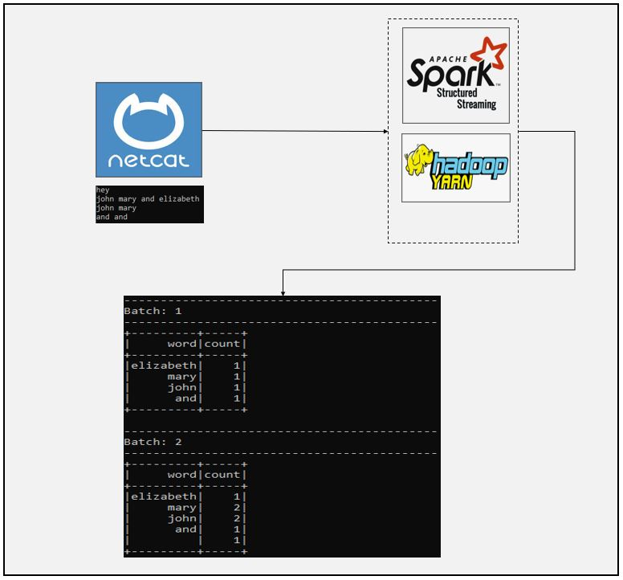

# SparkStream Word_Count Netcat Socket Example
### Dataflow Pipeline


### Summary

This is default example project for Spark DataFrame Streaming API

### Task List

- [x] Install netcat protocol if you are on Windows, if you are on linux you can use nc command

https://nmap.org/download.html

- [x] Open terminal/command window and type below command
```
nc -lk 9999
```
- [x] Create spark session (You can use ".master("local[*])" instead of yarn if you are running Spark on standalone mode")
```
if __name__ == "__main__":
    spark = SparkSession \
        .builder.appName("Streaming Word Count") \
        .config("spark.streaming.stopGracefullyOnShutdown", "true") \
        .master("yarn") \
        .getOrCreate()
```
- [x] Read data from socket port 9999
```
## Read
## Reading data from port 9999
    lines_df = spark.readStream \
        .format("socket") \
        .option("host", "localhost") \
        .option("port", "9999") \
        .load()

```
- [x] Transform data to count words
```
## Transform
## Transform it and save it as dataframe with column name word and apply count method
    words_df = lines_df.select(expr("explode(split(value,' ')) as word"))
    counts_df = words_df.groupBy("word").count()
```
- [x] Sink it to the console
```
## Sink
## Sink it into console
    word_count_query = counts_df.writeStream \
        .format("console") \
        .option("checkpointLocation", "WC_Example/chk-point-dir") \
        .outputMode("complete") \
        .start()

    logger.info("Listening to localhost:9999")
    word_count_query.awaitTermination()
```
- [x] You can set log4j logger using logger library
```
logger = Log4j(spark)
```

### Code Description

logger.py is logger class using log4j properties

StreamingWC.py is spark script

### Running

1. Use nc command

```
nc -lk 9999
```

2. Start spark job
```
spark-submit StreamingWC.py
```

3. Type somem message on nc terminal

```
This is a trial message for a word count example
```

4. Check results
